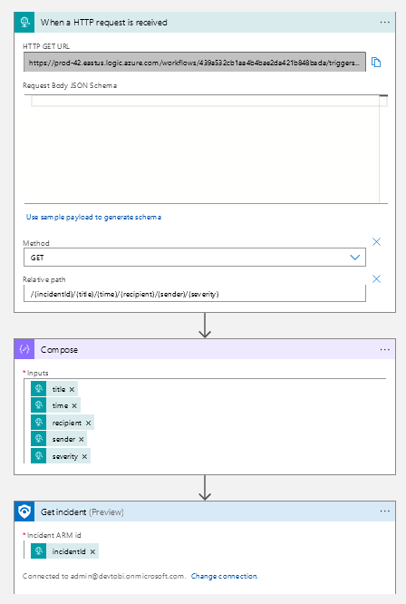

# Post Powershell Card

[](https://portal.azure.com/#create/Microsoft.Template/uri/https%3A%2F%2Fraw.githubusercontent.com%2FStyx665%2FMCTMeeting%2Fmain%2FLogic%2520Apps%2FCardResponse.json)

Hier befindet sich Skript für den Versand einer Adaptive Card in einen Teams-Channel. Hierfür ist die Einrichtung eines [Incoming Webhooks](https://shorturl.at/nxYZ8) erforderlich.

Das Skript liest eine vorgefertigte Card und ersetzt dynamisch vordefinierte Werte. Die fertige Card wird daraufhin in einen Teams-Channel gepostet.

Die "Disable User" Card-Action Endpoint verweist auf eine Logic App mit HTTP-Trigger.

Das senden der Card geschieht über einen einfachen Post Request an den Endpoint 

```powershell
$card = Get-Content '.\card.json'

Invoke-RestMethod -Method post -ContentType 'Application/Json' -Body $card -Uri $webhook
```

Der WEbhook, der die Response entgegennimmt ist an der stelle `url` fest hinterlegt, die Werte, die wir selbst mitgeben werden durch das Skript dynamisch ersetzt (`XY_ACTION`)

```json
...,
{
    "actions": 
    [ 
        {
            "title": "Disable User",
            "type": "Action.OpenUrl",
            "url": "https://prod-42.eastus.lo...nual/paths/invoke/XY_ACTION"
        },
        {
            "title": "Close Incident",
            "type": "Action.Submit"
        }
    ],
    "type": "ActionSet"
},
...
```


- script verlinken
- card anpassung
- actions müssen anders entgegengenommen werden
- 
