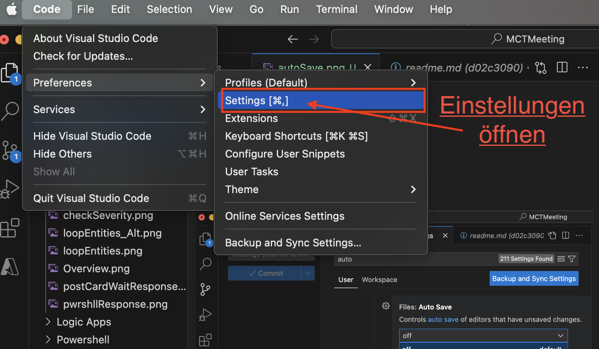
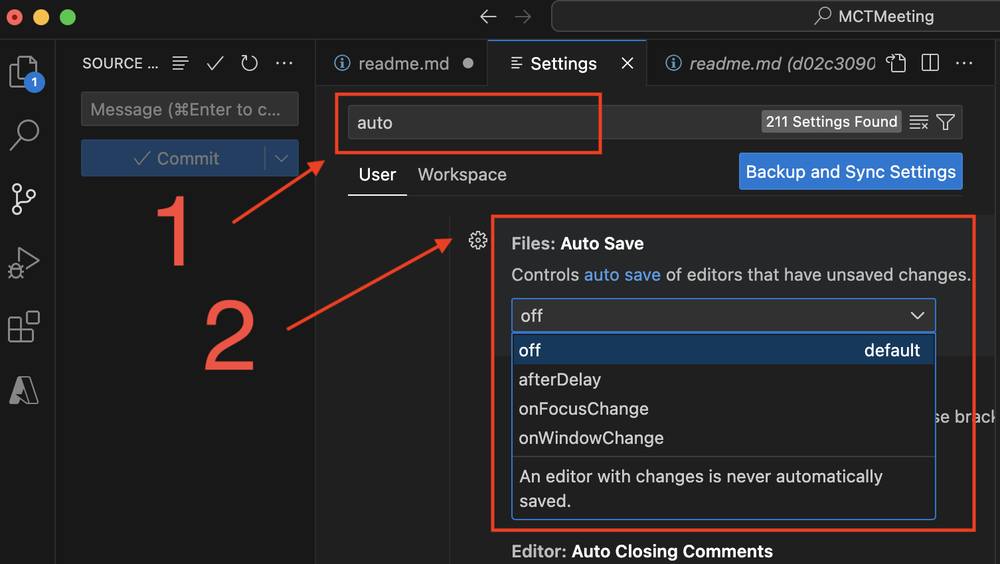
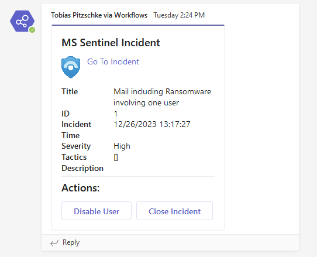
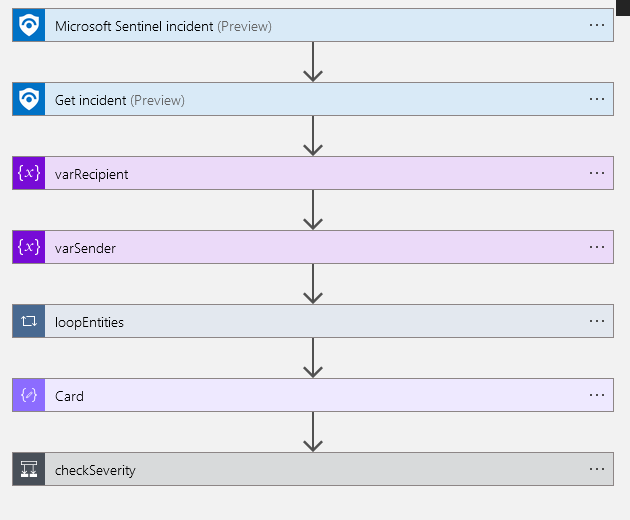
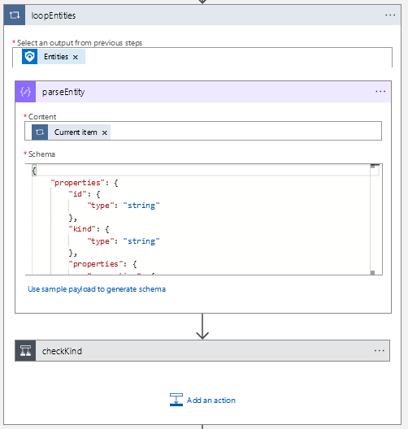
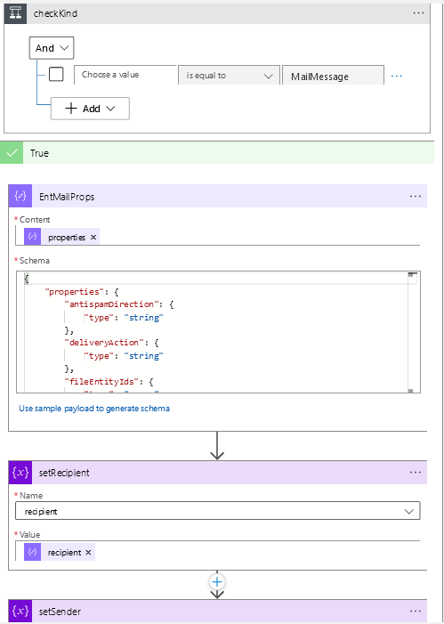
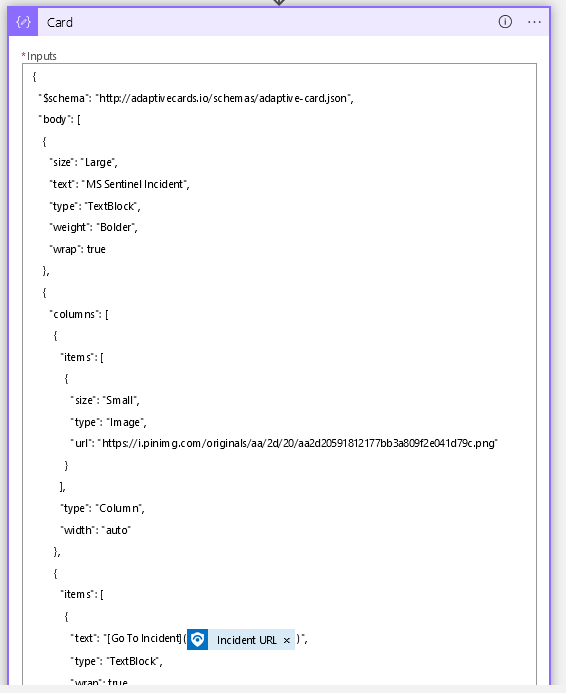
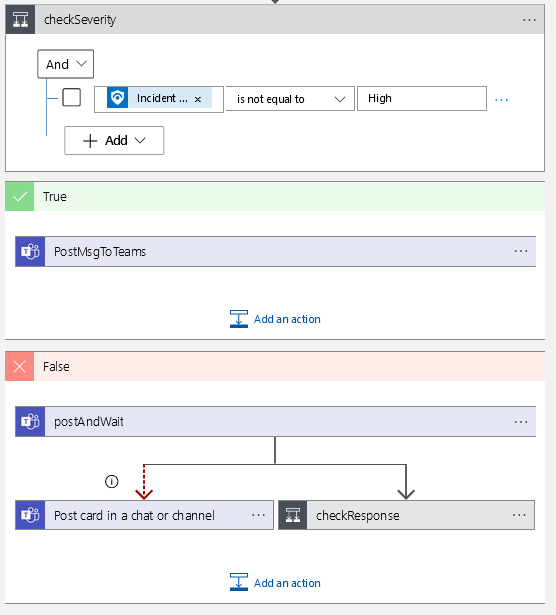
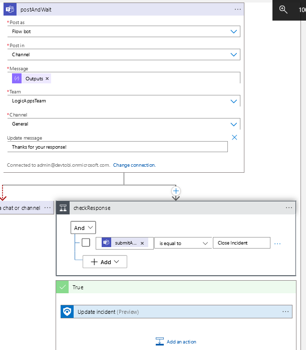
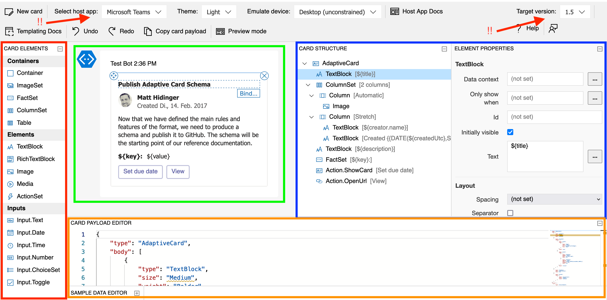

# MCT Meeting

## :warning::warning: Update :warning::warning:
Weil die Frage aufkam und nicht endgültig beantwortet wurde:
<details> 
<summary>Ja, VS Code hat auch eine Auto-Save funktion ( :point_left: click me)
</summary><br>
Geht in die Einstellungen:


und sucht in der globalen Suche nach "`Auto Save`".<br>
Ihr bekommt verschiede Vorschläge nach welcher Methodik er speichern soll.


</details> 

---
<br>
<br>
- **Warum langweile ich euch heute ?**
  - Lars wollte irgendwas mit Azure Sentinel. :roll_eyes:

- **Womit langweile ich euch heute?**
  - Mit Logic Apps und Sentinel. Das Ganze dient nur als Vorwand, um euch etwas über Teams und Adaptive Cards zu zeigen.
  - <sup> Evtl ein paar [Markdown](https://docs.github.com/en/enterprise-cloud@latest/get-started/writing-on-github/getting-started-with-writing-and-formatting-on-github/quickstart-for-writing-on-github) Tricks </sup>

- **Was ist das und warum sollte man das kennen?**
  - Teams, unser ultimativer Hub für alles Mögliche, bietet eine super Möglichkeit, faule User mit mehr Shortcuts zur Arbeit zu bewegen.


## [Post-Incident Card](Logic%20Apps/readme.md) 

[](https://portal.azure.com/#create/Microsoft.Template/uri/https%3a%2f%2fraw.githubusercontent.com%2fStyx665%2fMCTMeeting%2fmain%2fLogic%2520Apps%2fSentinelPostCard.json)

<details>
<summary> Das Ziel ist es, den Incident in Teams darzustellen und direkt eine Aktion auszuführen. </summary> 



Im Fall von Azure Sentinel erfolgt dies über eine Azure Logic App.



Der Workflow besteht aus einem Trigger und mindestens einer Aktion. Bei Meldung eines Incidents an Sentinel erhalten wir die Information, dass ein Incident mit ```ARM ID XY``` ausgelöst wurde. Über diese Info gelangen wir an alle weiteren Details. Beispielhaft suchen wir Empfänger und Absender einer Mail, indem wir die Entities durchsuchen.



Ein Incident hat i.d.R. verschiedene Arten von Entities, wir interessieren uns für ```MailMessage```.



Zum einfacheren Verarbeiten wird das JSON-Objekt geparst, somit haben wir direkten Zugriff auf alle Felder.

Anschließend fügen wir alle dynamischen Werte, also alles, was sich bei jedem neuen Durchlauf ändern kann, in die Card ein.



Vor dem Posten der Card in den Channel entscheiden wir, abhängig von der ```Severity```, in welchen Channel wir was posten wollen.



Für alle ernsten Incidents (```High```) posten wir die Card, um schnell die wichtigsten Schritte einzuleiten. Alle anderen Incidents werden als einfache Nachricht gepostet.

Wenn eine Aktion ausgeführt werden soll, warten wir auf die ```Response```.



Die Aktion können wir selbst definieren und abfragen. Auf den zurückgegebenen Return-Wert wird dann entsprechend reagiert.

```json
{
  "actions": [
    {
      "title": "Disable User",    #<----- Return-Wert
      "type": "Action.Submit",
    },
    {
      "title": "Close Incident",  #<----- Return-Wert
      "type": "Action.Submit"
    }
  ],
  "type": "ActionSet"
}
```
</details>

## [Post Powershell Card](Powershell/readme.md)

[](https://portal.azure.com/#create/Microsoft.Template/uri/https%3A%2F%2Fraw.githubusercontent.com%2FStyx665%2FMCTMeeting%2Fmain%2FLogic%2520Apps%2FCardResponse.json)

<details>
<summary>Senden einer Card per Powershell Script</summary>

Im Verzeichnis `powershell` befindet sich ein Skript für den Versand einer Adaptive Card in einen Teams-Channel. Hierfür ist die Einrichtung eines [Incoming Webhooks](https://shorturl.at/nxYZ8) erforderlich.

Das Skript liest eine vorgefertigte Card und ersetzt dynamisch vordefinierte Werte. Die fertige Card wird daraufhin in einen Teams-Channel gepostet.

Die "Disable User" Card-Action Endpoint verweist auf eine Logic App mit HTTP-Trigger.


</details>

## [Card Designer](https://adaptivecards.io/designer/)

:red_circle: Verfügbare Elemente

:green_circle: Vorschau der gerenderten Card

:large_blue_circle: Genutze Elemente in Baumstruktur und deren Properties

:orange_circle: Das eigentliche JSON

:bangbang: Auf die Version und den Client achten



#### TODO 
- Deployment - Subscription Parameter can maybe be omitted
